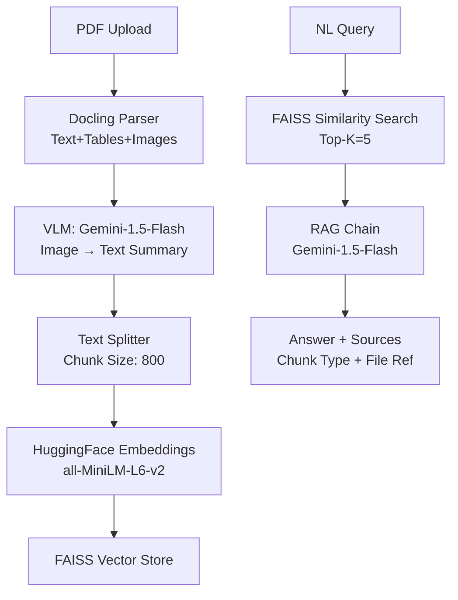

# Automotive Service Manual RAG System

A **Multimodal RAG API** for automotive mechanics to query service manuals (PDFs with text, tables, wiring diagrams) using natural language. Built for **BITS WILP Multimodal RAG Bootcamp**. [file:21]

[](http://localhost:8000/docs)

## Problem Statement 

### 1. Domain Identification
**Automotive Service & Repair** - Independent garages and service centers in India servicing passenger vehicles (Maruti, Hyundai, Tata, Mahindra).

### 2. Problem Description
Mechanics spend **60-70% of diagnosis time** manually searching printed service manuals (200-500 page PDFs). These manuals contain:
- **Text**: Troubleshooting procedures, specifications
- **Tables**: Torque values, fluid capacities, clearance specs  
- **Images/Diagrams**: Wiring schematics, exploded assembly views, sensor locations

**Current struggle**: No full-text search. Mechanics flip pages or use Ctrl+F on digital PDFs, missing cross-references between tables/images/text.

**Example**: "Cylinder head bolt torque for 2024 Hyundai Creta 1.5L" requires checking:
1. Engine section (text) → confirms bolt grade
2. Torque table (page 156) → M10 = 78 Nm + 90°
3. Diagram (page 162) → confirms bolt locations

### 3. Why This Problem Is Unique
- **Domain-specific terminology**: "TDC", "crank angle sensor", "EGR valve"
- **Cross-modal queries**: "Show EGR valve location + removal torque"
- **Regulatory tables**: Safety-critical specs with footnotes/conditions
- **Engineering diagrams**: Need VLM to extract labels/measurements from wiring diagrams

Traditional search fails because specs are split across modalities.

### 4. Why RAG Is Perfect
- **No fine-tuning needed** - Works on any service manual PDF
- **Grounded answers** - References exact page/chunk type
- **Multimodal** - Combines text/tables/images in single response
- **Incremental** - Add new manuals without retraining

**vs Fine-tuning**: Can't handle new car models/manuals  
**vs Keyword search**: Misses semantic matches ("tightening sequence" ≠ "torque order")

### 5. Expected Outcomes
Enable mechanics to answer:
- "What torque for Creta cylinder head bolts?"
- "Where is the EGR valve on 2024 Tata Nexon?"
- "What coolant type for Mahindra XUV300?"

**Business impact**: Reduce diagnosis time from 30min → 2min, increase throughput 3X.

## Architecture Overview



[image:52]

## Technology Choices

| Component | Choice | Justification |
|-----------|--------|---------------|
| **Parser** | Docling 1.3.0 | Multimodal extraction (text/tables/images), production-ready |
| **Embeddings** | all-MiniLM-L6-v2 | Fast, accurate, works offline |
| **Vector Store** | FAISS | High-speed similarity search, persistent indexing |
| **VLM** | Gemini-1.5-Flash | Free tier generous, excellent technical diagram understanding |
| **LLM** | Gemini-1.5-Flash | Cost-free, handles automotive technical context well |
| **API** | FastAPI | Auto Swagger docs, Pydantic validation, production-ready |

## Setup Instructions

1. **Clone & Install**
```bash
git clone <your-repo-url>
cd automotive-service-rag
pip install -r requirements.txt
```

2. **Configure API Key**
```bash
cp .env.example .env

3. **Run Server**
```bash
uvicorn main:app --reload --port 8000
```

4. **Access API**: `http://localhost:8000/docs`

## API Endpoints

| Method | Endpoint | Description |
|--------|----------|-------------|
| `GET` | `/health` | System status, indexed docs count |
| `POST` | `/ingest` | Upload PDF → parse → embed → index |
| `POST` | `/query` | NL question → RAG answer + sources |
| `GET` | `/docs` | Interactive Swagger documentation |

**Sample Query**:
```json
POST /query
{
  "question": "What is cylinder head torque spec?"
}
```

## Screenshots

### 1. Swagger UI


### 2. Health Check


### 3. PDF Ingest Success


### 4. Text Query Result


### 5. Table Query Result  


### 6. Image Query Result


## Sample Automotive PDF
`sample_documents/service_manual.pdf` - Multimodal service manual with text, torque tables, and wiring diagrams.

## Limitations & Future Work
- **Single PDF**: Needs document management (list/delete)
- **Cold start**: First query slow (embedding download)
- **Rate limits**: Free Gemini tier (15 RPM)
- **Future**: Multi-PDF collections, hybrid search, PDF preprocessing

---
**Built for BITS WILP Multimodal RAG Assignment** - Rajeev 2024tm05054, April 2026
